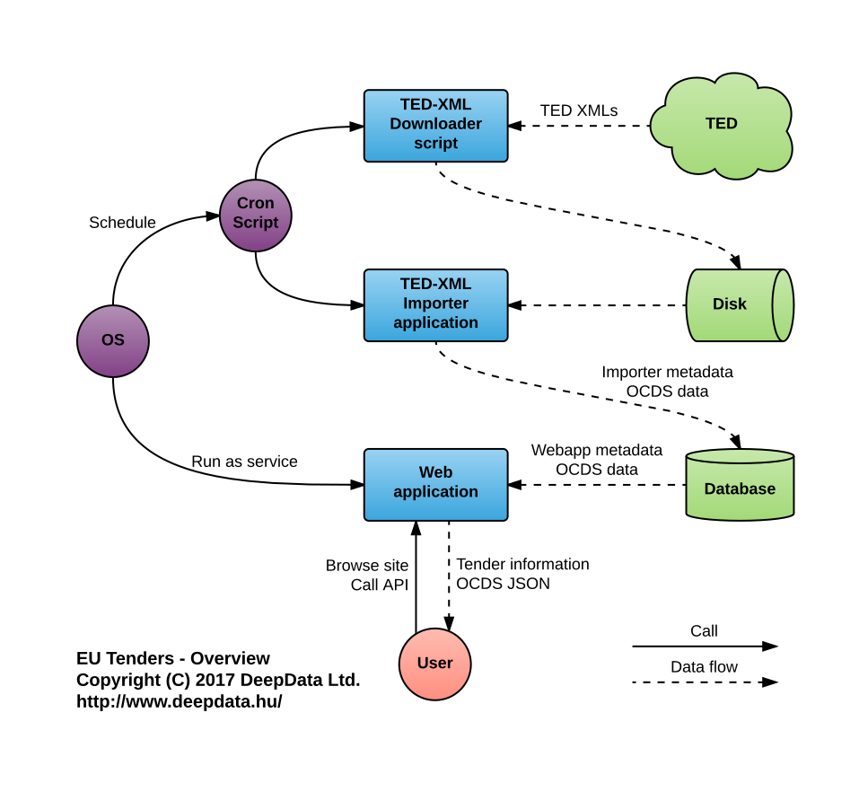

## What does TenderBase do?

* Fetches tender (notice) information from [TED](http://ted.europa.eu/).
* Converts this data to [OCDS](http://standard.open-contracting.org/).
* Serves information as a website.
* Provides an [API](api-documentation.md) for retrieving OCDS releases.

## How does it work?

A picture's worth a thousand words:

### Call chain

* The operating system schedules the cron script to run periodically, e.g. once a day.
* The cron script calls the [TED-XML downloader](ted-xml-downloader.md) script, then it calls the [TED-XML importer](ted-xml-importer.md) program.
* Meanwhile the OS runs the web application as a service.

### Data flow

* The input data is located on TED's [FTP server](ftp://ted.europa.eu/).
* The [TED-XML downloader](ted-xml-downloader.md) script fetches the XML archives and stores them on the local disk.
* After that, [TED-XML importer](ted-xml-importer.md) reads the XMLs, converts them to OCDS + web application metadata and saves them into the database.
* The web application reads the information from the database and serves it as a webpage and also via an [API](api-documentation.md).
